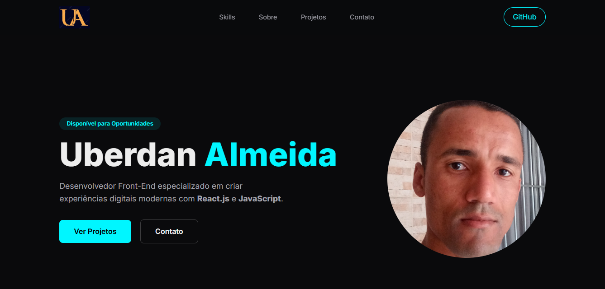

# **Portfólio | Uberdan Almeida** 🚀

---

## 💎 Sobre o Projeto

Este projeto consiste no meu **Portfólio Pessoal Front-End**, desenvolvido para apresentar de forma profissional minhas **habilidades**, **tecnologias dominadas** e **projetos publicados no GitHub**.

O grande diferencial do portfólio está na **integração direta com a API do GitHub**, permitindo que os projetos sejam listados automaticamente, sem necessidade de manutenção manual. Sempre que um novo repositório público é criado, ele passa a aparecer no site.

O design segue uma proposta **Dark Futurista**, combinando:

* 🎨 Glassmorphism
* 🌌 Tons escuros sofisticados
* ⚡ Cores neon para destaque
* ✨ Animações suaves e modernas

Tudo foi pensado para oferecer uma **experiência imersiva**, limpa e objetiva, valorizando o conteúdo e a usabilidade.

---

## 🎯 Objetivo do Projeto

* Consolidar minha **presença profissional online**
* Centralizar meus principais projetos em um único local
* Demonstrar domínio de **HTML, CSS e JavaScript puro**
* Aplicar boas práticas de **UI/UX**, responsividade e performance

---

## ✨ Funcionalidades Principais

* 📦 **Integração com a API do GitHub**
  Consome a API pública do GitHub para listar automaticamente todos os repositórios do usuário.

* 🖼️ **Sistema Inteligente de Thumbnails**

  * Prioriza a imagem `thumbnail.png` presente no repositório
  * Caso não exista, gera automaticamente uma captura de tela do site (quando disponível)
  * Utiliza placeholder estilizado como último fallback

* 📂 **Renderização Dinâmica de Projetos**
  Os cards de projetos são gerados via JavaScript, sem HTML estático.

* ➕ **Botão "Ver Todos os Projetos"**
  Exibe inicialmente apenas alguns projetos para melhor performance e experiência do usuário.

* 📱 **Design Totalmente Responsivo**
  Adaptado para dispositivos móveis, tablets e desktops (Mobile First).

* ⚡ **Scroll Suave e Navegação Interna**
  Transições suaves entre as seções do site.

* 🔍 **Header Interativo**
  Efeito de blur, mudança de opacidade e sombra dinâmica ao rolar a página.

---

## 🛠 Tecnologias Utilizadas

| 🧱 **HTML5**             | Estrutura semântica e acessível do site                               |
| 🎨 **CSS3**              | Estilização avançada com Flexbox, Grid, variáveis CSS e media queries |
| ⚙️ **JavaScript (ES6+)** | Consumo de API (Fetch), manipulação de DOM e lógica de renderização   |
| 🔤 **Inter Font**        | Tipografia moderna via Google Fonts                                   |
| 🌐 **GitHub API**        | Fonte dinâmica de dados dos projetos                                  |

---

## 🧠 Lógica de Funcionamento

1. O JavaScript realiza uma requisição à API do GitHub
2. Os repositórios públicos são armazenados em memória
3. Apenas uma quantidade inicial de projetos é exibida
4. O usuário pode carregar todos os projetos com um clique
5. Cada projeto gera automaticamente:

   * Nome formatado
   * Descrição
   * Imagem de preview
   * Link direto para o repositório

---

## 🌍 Possibilidades de Deploy

Este projeto pode ser publicado facilmente em:

* 🚀 GitHub Pages
* ⚡ Vercel
* 🌐 Netlify